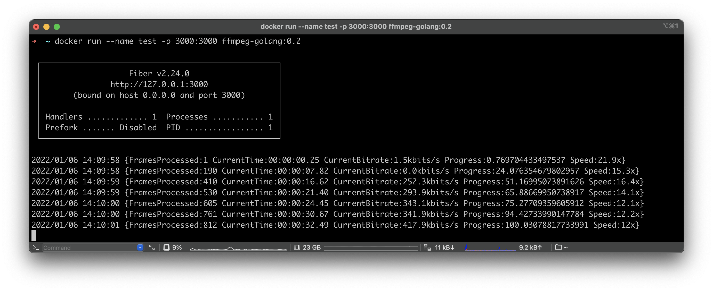
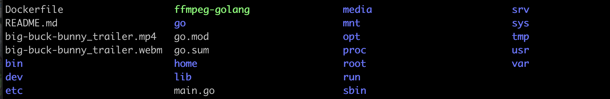

# FFmpeg & Golang on alpine

## Stack 
- [golang:1.17.5-alpine3.15](https://hub.docker.com/_/golang/)
- [FFmpeg Staic Builds](https://johnvansickle.com/ffmpeg/)
    - Release 4.4.1

## Building & Development
```dockerfile
RUN wget https://johnvansickle.com/ffmpeg/releases/ffmpeg-release-amd64-static.tar.xz
RUN tar -xvJf  ffmpeg-release-amd64-static.tar.xz
```

```shell
# Connecting to the Docker Container
$ docker exec -it 6a4ddfe097507b97ace31e37f3117b4d64c67bc474f518f5d47f315d22fd659d /bin/sh
# On Docker Container
$ ffmpeg
ffmpeg version 4.4.1-static https://johnvansickle.com/ffmpeg/  Copyright (c) 2000-2021 the FFmpeg developers
  built with gcc 8 (Debian 8.3.0-6)
  configuration: --enable-gpl --enable-version3 --enable-static --disable-debug --disable-ffplay --disable-indev=sndio --disable-outdev=sndio --cc=gcc --enable-fontconfig --enable-frei0r --enable-gnutls --enable-gmp --enable-libgme --enable-gray --enable-libaom --enable-libfribidi --enable-libass --enable-libvmaf --enable-libfreetype --enable-libmp3lame --enable-libopencore-amrnb --enable-libopencore-amrwb --enable-libopenjpeg --enable-librubberband --enable-libsoxr --enable-libspeex --enable-libsrt --enable-libvorbis --enable-libopus --enable-libtheora --enable-libvidstab --enable-libvo-amrwbenc --enable-libvpx --enable-libwebp --enable-libx264 --enable-libx265 --enable-libxml2 --enable-libdav1d --enable-libxvid --enable-libzvbi --enable-libzimg
  libavutil      56. 70.100 / 56. 70.100
  libavcodec     58.134.100 / 58.134.100
  libavformat    58. 76.100 / 58. 76.100
  libavdevice    58. 13.100 / 58. 13.100
  libavfilter     7.110.100 /  7.110.100
  libswscale      5.  9.100 /  5.  9.100
  libswresample   3.  9.100 /  3.  9.100
  libpostproc    55.  9.100 / 55.  9.100
Hyper fast Audio and Video encoder
usage: ffmpeg [options] [[infile options] -i infile]... {[outfile options] outfile}...

Use -h to get full help or, even better, run 'man ffmpeg'
```

## TESTING on Docker
[**TEST Webm File**](https://www.webmfiles.org/demo-files/)를 이용하여서 진행하였습니다. webm에서 mp4로 변환합니다.


```shell
2022/01/06 14:09:58 {FramesProcessed:1 CurrentTime:00:00:00.25 CurrentBitrate:1.5kbits/s Progress:0.769704433497537 Speed:21.9x}
2022/01/06 14:09:58 {FramesProcessed:190 CurrentTime:00:00:07.82 CurrentBitrate:0.0kbits/s Progress:24.076354679802957 Speed:15.3x}
2022/01/06 14:09:59 {FramesProcessed:410 CurrentTime:00:00:16.62 CurrentBitrate:252.3kbits/s Progress:51.16995073891626 Speed:16.4x}
2022/01/06 14:09:59 {FramesProcessed:530 CurrentTime:00:00:21.40 CurrentBitrate:293.9kbits/s Progress:65.88669950738917 Speed:14.1x}
2022/01/06 14:10:00 {FramesProcessed:605 CurrentTime:00:00:24.45 CurrentBitrate:343.1kbits/s Progress:75.27709359605912 Speed:12.1x}
2022/01/06 14:10:00 {FramesProcessed:761 CurrentTime:00:00:30.67 CurrentBitrate:341.9kbits/s Progress:94.42733990147784 Speed:12.2x}
2022/01/06 14:10:01 {FramesProcessed:812 CurrentTime:00:00:32.49 CurrentBitrate:417.9kbits/s Progress:100.03078817733991 Speed:12x}
```



